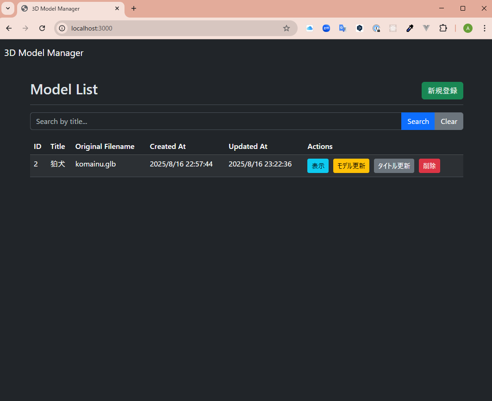
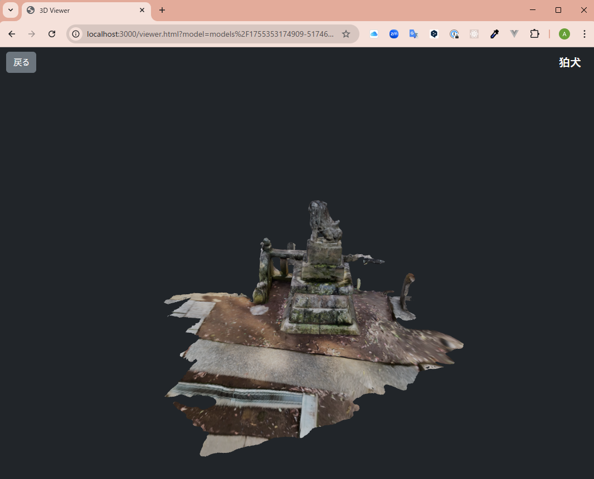

# 3D Model Manager

A simple web application for uploading, managing, and viewing 3D models, built with Node.js, Express, and Three.js.

This project was bootstrapped and developed with the assistance of Google's Gemini.

## Features

- **Model Upload**: Upload 3D models in `.glb` and `.gltf` formats.
- **List View**: Displays all registered models in a clean, sortable table with details like title, filename, and timestamps.
- **Interactive 3D Viewer**: View models in an interactive WebGL canvas. Rotate, pan, and zoom with mouse controls.
- **CRUD Operations**: Full Create, Read, Update, and Delete functionality for models.
  - **Granular Updates**: Update the 3D model file and its title independently.
  - **Soft Deletes**: Models are marked as deleted without being permanently removed from the database.
- **Title Search**: Quickly find models by searching for their titles.
- **Timestamp Tracking**: Automatically records and displays creation (`Created At`) and modification (`Updated At`) times in JST.

## Tech Stack

- **Backend**: Node.js, Express.js
- **Database**: SQLite
- **File Uploads**: Multer
- **3D Rendering**: Three.js

## Setup & Installation

1. **Clone the repository:**

   ```sh
   git clone https://github.com/aktnk/3D_model_manager.git
   ```

2. **Navigate to the project directory:**

   ```sh
   cd 3D_model_mannager
   ```

3. **Install dependencies:**
   ```sh
   npm install
   ```

## Usage

1. **Start the server:**

   ```sh
   node server.js
   ```

2. **Open the application:**
   Open your web browser and navigate to `http://localhost:3000`.

   
   

## License

This project is licensed under the MIT License. See the `LICENSE` file for details.

### Third-Party Libraries

The following third-party libraries are used in this project. They are all licensed under the MIT License.

- [Express.js](https://expressjs.com/)
- [Multer](https://github.com/expressjs/multer)
- [SQLite3](https://github.com/TryGhost/node-sqlite3)
- [Three.js](https://threejs.org/)
