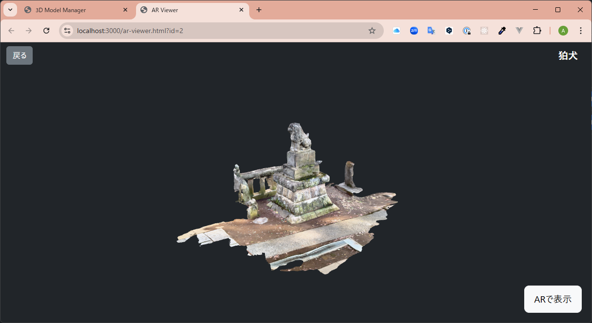

# 3D Model Manager

A simple web application for uploading, managing, and viewing 3D models, built with Node.js, Express, and Three.js. This project was bootstrapped and developed with the assistance of Google's Gemini.

## Features

- **Model Upload**: Upload 3D models in `.glb` and `.gltf` formats.
- **Responsive List View**: Displays all registered models in a responsive card grid. Each card features an interactive 3D preview of the model.
- **Web-based AR**: View 3D models in Augmented Reality directly from your browser on compatible iOS and Android devices.
- **Interactive 3D Viewer**: View models in an interactive WebGL canvas. Rotate, pan, and zoom with mouse controls.
- **CRUD Operations**: Full Create, Read, Update, and Delete functionality for models.
  - **Granular Updates**: Update the 3D model file and its title independently.
  - **Soft Deletes**: Models are marked as deleted without being permanently removed from the database.
- **Title Search**: Quickly find models by searching for their titles.

## Tech Stack

- **Backend**: Node.js, Express.js
- **Database**: SQLite
- **File Uploads**: Multer
- **3D Rendering**: Three.js, `<model-viewer>`

## Getting Started with Docker

This project is configured to run in a Docker container, providing a consistent and isolated development environment.

### Prerequisites

- [Docker](https://www.docker.com/)
- [Docker Compose](https://docs.docker.com/compose/install/)

### Setup and Running the Application

1.  **Clone the repository:**

    ```sh
    git clone https://github.com/aktnk/3D_model_manager.git
    cd 3D_model_manager
    ```

2.  **Build and start the container:**
    Run the following command from the project's root directory. This will build the Docker image and start the application in the background.

    ```bash
    docker compose up -d --build
    ```

3.  **Open the application:**
    Navigate to [http://localhost:3000](http://localhost:3000).

    
    
    

### Development

- **Live Reloading**: Changes to the source code are immediately reflected in the container.
- **Viewing Logs**: `docker compose logs -f`
- **Stopping the Application**: `docker compose down`

## Troubleshooting

### AR feature is not working or the icon doesn't appear

If you have trouble viewing a model in AR, please check the following:

1.  **Is your device compatible?** Your phone must support ARCore (Android) or ARKit (iOS).
2.  **Is the model file size optimized?** For best performance on mobile devices, model files should ideally be under 5MB. Very large models may fail to load in AR.
3.  **(For iOS) Is there a `.usdz` file?** While not always required, providing a `.usdz` version of your model is the most reliable way to ensure AR works on iPhones and iPads.

## License

This project is licensed under the MIT License. See the `LICENSE` file for details.

### Third-Party Libraries

The following third-party libraries are used in this project. They are all licensed under the MIT License.

- [Express.js](https://expressjs.com/)
- [Multer](https://github.com/expressjs/multer)
- [SQLite3](https://github.com/TryGhost/node-sqlite3)
- [Three.js](https://threejs.org/)
- [\<model-viewer\>](https://modelviewer.dev/)